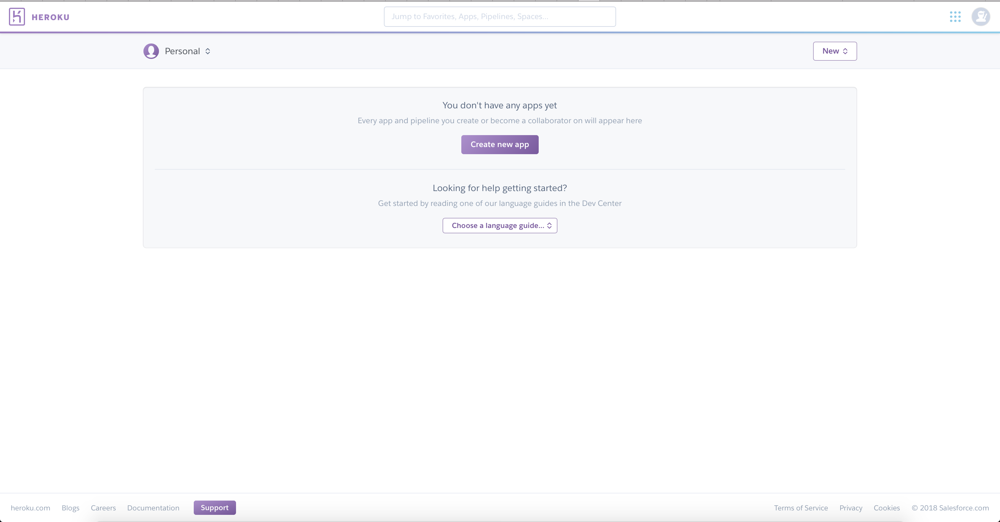

## Cuarta Semana (24 de Octubre de 2018)

#### Ejercicio 1. Darse de alta en algún servicio PaaS.

He decidido darme de alta en Heroku, ya que es uno de los PaaS más utilizados y fiables en la actualidad, por su fuerte enfoque en resolver el despliegue de una aplicación.  Para darme de alta en Heroku:

1. Entrar en la página https://signup.heroku.com
2. Rellenar un formulario como el siguiente:

  

3. Confirmar tu cuenta.
4. Y ya podemos empezar a desplegar aplicaciones en la nube.

  

Más adelante [veremos como crear un proyecto y subirlo a heroku](https://www.uno-de-piera.com/heroku-servicio-de-computacion-en-la-nube/)
