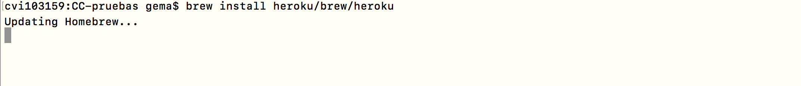
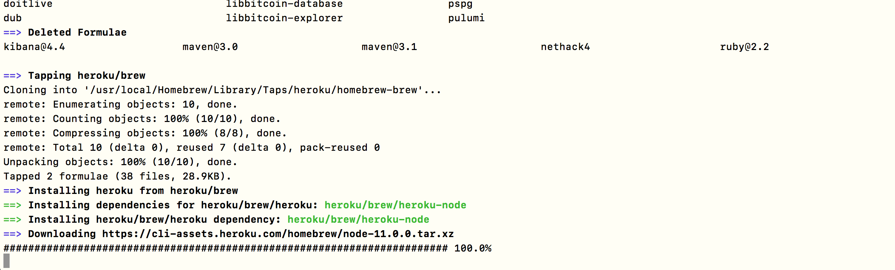
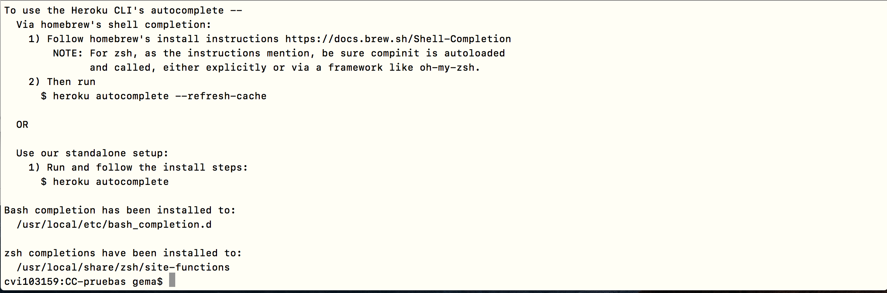
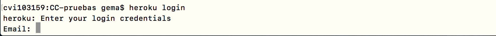
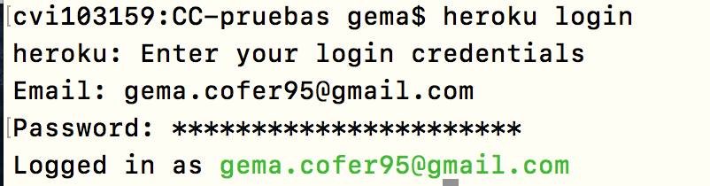

## Quinta Semana (31 de Octubre de 2018)

#### Objetivo 1. Instalar las herramientas de línea de órdenes de las herramientas cloud, en este caso de [Heroku](https://devcenter.heroku.com/articles/getting-started-with-python).

Hacer uso de `brew install heroku/brew/heroku`:

  

  

  

  

  

