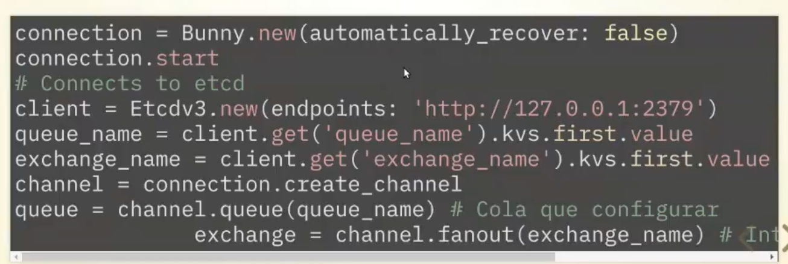
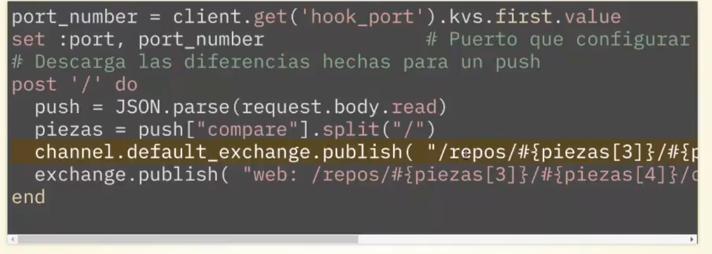
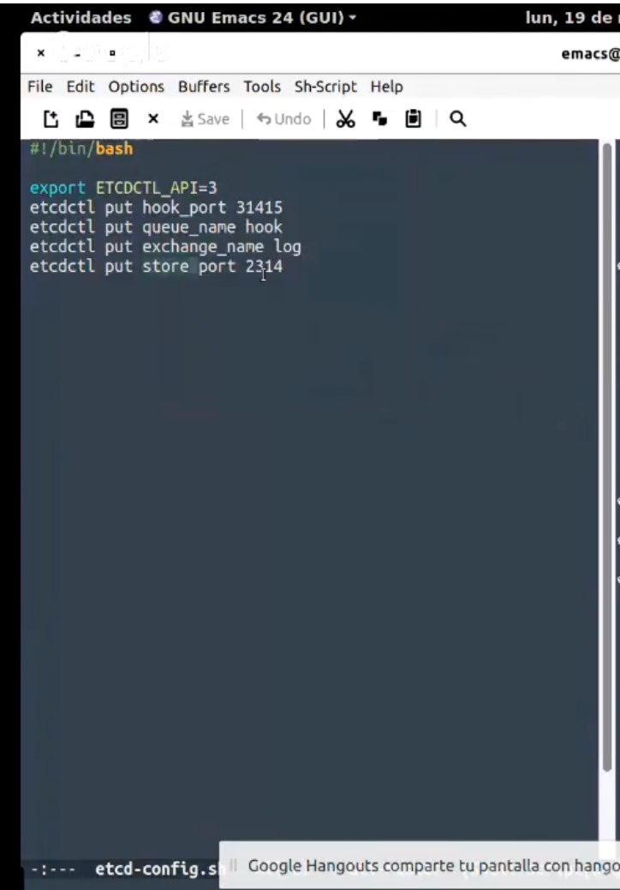
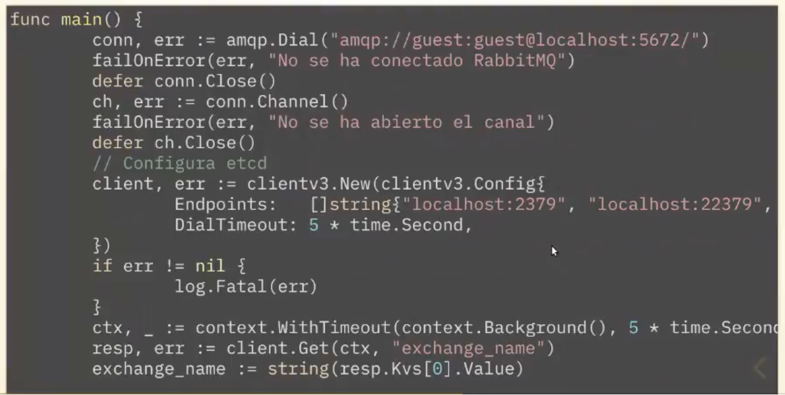
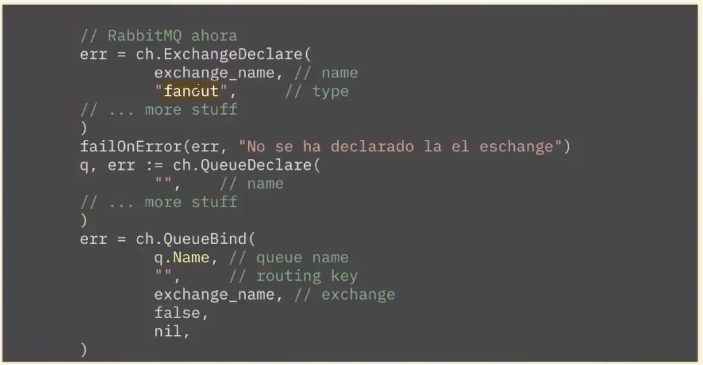
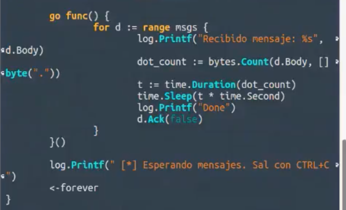
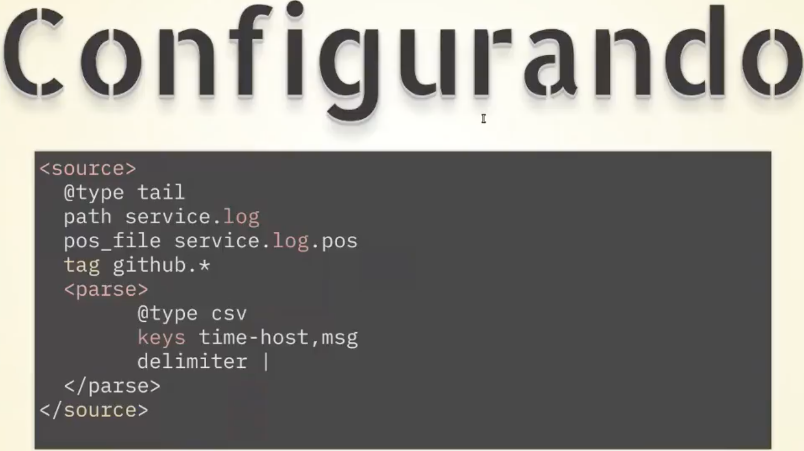
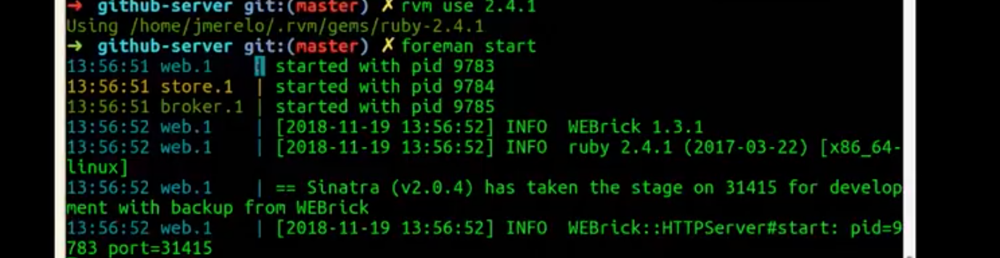
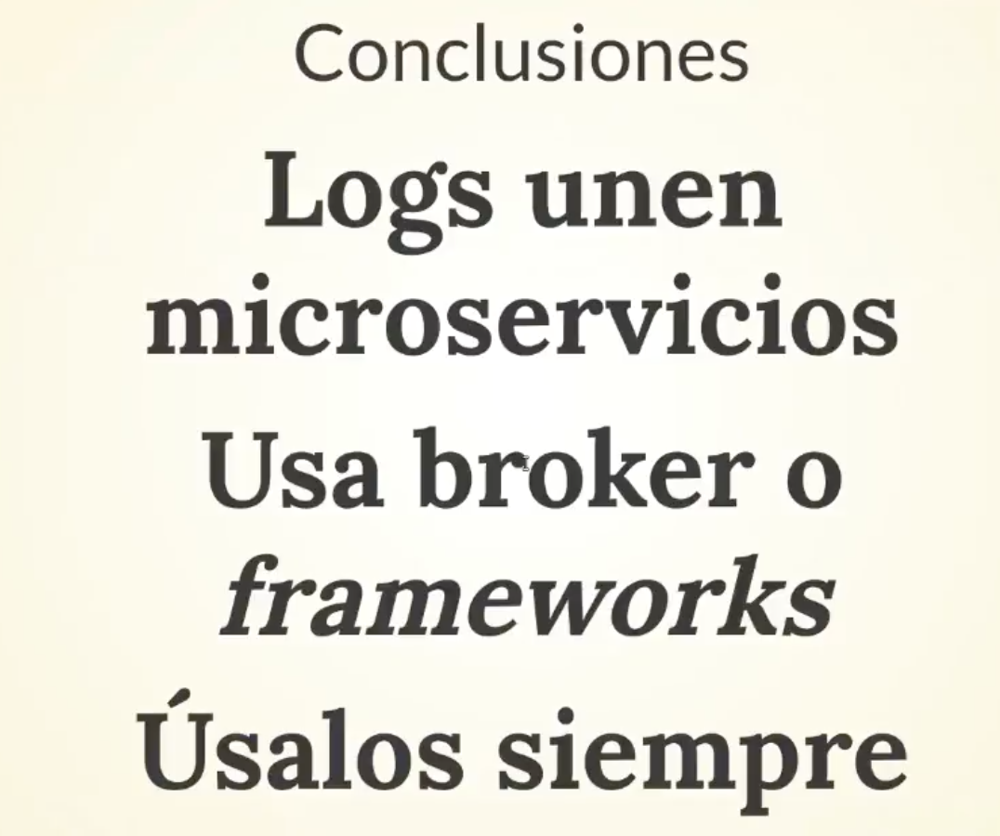

# Seminario sobre LOGS

## Logs modernos

`$foreman start`
- __unificar los logs__
- Especificar como se van a mostrar los logs
- Se pueden parar de forma unificada
- Escrito en ruby
- Contiene
    - la hora
    - el tipo de proceso que tiene (etiqueta)
    - breve descripción

## Microservicios

### Broker
- Paso de mensajes (trae y lleva mensajes)
- Puede actuar como loger

#### Usando brokers

- Le estoy diciendo que me dé el nombre de la cola, y extrae clave-valor, donde tenemos una cadena que contiene el nombre de la cola.
- Los brokers tienen dos tipos de estructuras:
  - colas: son FIFO
  - exchanges o intercambios: tipo broadcast
- Estos son facilidades de RabbitMQ, este exchange lo vamos a usar como algo centralizado para los logs.

------

- Ahora en el log vamos a poner una etiqueta delante y que envíe este exchange
~~~
etiqueta:URL
~~~

- Estamos haciendo uso de exchange
- Estamod usando configuración distribuida
------
- Tenemos los 3 microservicios y queremos trabajar de otra manera para ello se __usan brokers__
- Los almacenes almacenar de tipo clave-valor

--------

- Esto está levantado en un puerto y puedes tener cualquier tipo de seguridad.
- Es distribuido: IPs
- Se pueden usar otros sistemas

--------

##### Almacenando

Vamos hacer un cliente para ese intercambio (lenguaje GO)

- 1-5 líneas: tenemos que decir nos conectamos --> RabbitMQ
- 5-8 líneas: conectando a etc
  - estamos usando el log especifico paa GO, se podría pasar al exhangem en este caso no está hecho
- Nosotros queremos leer de ese intercambio

- GO tiene estructuras propias: canales: leer y escribir de forma concurrente
- Vamos a ligar una cola con un intercambios: `ch.QueueBid(....)`

- Lp va ejecutar de forma concurrente
- Cuando lo vamos a ejecutar (`<- forever`)

##### Uso de framework de logging

- **Logstash**
- Fuent, otros

- Que se consigue con ellos: los tienen funcionando y solo necesitar usar su API para leer sus logs

##### Partes de logs

- **Input**: Donde va empezar a leer (HTTP, de un fichero, sys.log del sistema). Tu le dices leeme de aqui.
- **Filtro**: pequeños programas, expresiones regulares para decir yo estoy interesado en leer esto (en que me detecte este error)
- **Almacén**: reddis, mongo almacenes de datos que son configurables, algunos almecenan en el sistema de ficheroos

- Yo configuro esto de una forma, para que el sistema de logs me lo lea y crear un estructura de datos (JSON) para yo leerlas donde quiera (que este el tiempo que quiera).

- **No le acaba de convencer `fluend`, dice que no funciona muy bien.**
- Usar Logstash

- Se ha escribir en un logs donde esté `tag github.*``
- Me va a parsear:
  - tipo CSV por comas
  - tiene dos columnas (time-host, msg)
  - delimitador |

1. Vision global de como funciona tu servicio (siempre distribuida)
2. borkers son mas caseros, sino frameworks como Logstash.
3. Así saber como esta funcionando nuestra arquitectura

### Logs

- Saber que se está haciendo.

### Configuración

- Todo el mundo tiene que saber donde mandar los logs, en que direccción IP está arrancado el broker.

Toda la información en su github: microservice-broker
https://github.com/JJ/microservices-broker
utiliza foreman para arrancar todos los Microservicios
