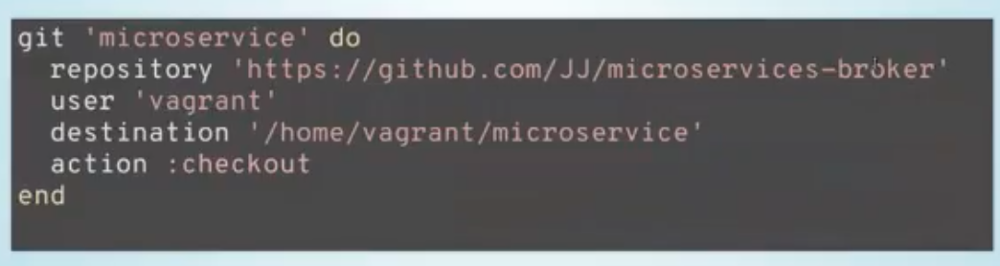

# Provisionando con Chef

**Provisionar = amueblar = acopiar**

Los pasos que hay que seguir:

1. **Provisionar**
2. **Comprobar**: herramientas idempotentes, es decir, el resultado va a ser siempre el mismo. Las herramientas de provisionamiento, tienen una declaraciones, en donde tu compruebas si lo tienes instalado y sino, lo instala.

## Usando chef-run

Para instalar Chef, debemos descargarlo desde la página principal.

Esta es la forma básica de instalar. Poner ordenes de chef y trabajar con recetas, en este caso, hemos creado una máquina virtual con Vagrant, y le decimos lo mismo que en el seminario de Ansible. Por defecto, chef instala unas cosas predeterminadas de Chef.

## ¿Qué hace chef-run?

Le especificas un recurso, un nombre y otras cosas, en este caso:
- El recurso es el localhost
- Un paquete que se llama ruby

Vamos a instalar python3 y en la figura anterior, donde en package pone ruby, poner "python3".

## Recursos

**Recursos --> tareas**  
**Recurso + Recurso + ... -> Receta**

Los recursos describen el estado deseado, por la idempotencia, avcees decsirbe los pasos para alcanzar, lo que interesa es el estado y el tipo (servicio, ppauqte, fichero) y dscribe una serie de propiedades adicionales.

Este tipo de recurso es paquete, en el cual vamos a instalar Ruby.

El supone que va a trabjar con un usuario que va a ser sudo.

## Usando recetas

Las receteas se usan cuando tengas que instalar varias cosas a la vez. Las recetas están escritas en Ruby. En esta imagen, se muestra como instalar git (lo primero que hay que instalar siempre):

- `:install` es un símbolo, cadena constante, se usa en Ruby para cadenas que tienen un nombre constante.

**¿Como se ejecuta?** `git.rb` es el nombre del fichero.

Ahora vamos a ver como descargar cosas con git:

Vamos a instalar la infraestructura necesaria para el repositorio. Esto se descarga el repositorio (usando git), pero a veces pasan cosas, que la versión de Ruby no sea la adecuada:

Vamos a instalar la versión 2.3 y da un error:

Para ello, hacemo uso de logs, ya que si algo falla hay que verlo ahí:

En los repos de Debian, no permite instalar otras versiones de Ruby. Pero lo importante, es mirar en los logs cuando falle algo, aunque estos logs son bastantes informativos.

**¿Cómo instalamos la app?** Usuario y directorio.

Te informa de que ese es el directorio en cual va a estar el usuario `user`, pero no te crea el directorio, por lo que hay que crearlo con `directory`.

**Creando una clave secreta**

El 1, es el salt, lo que sirve para encriptar.

**Instalando de verdad**

Ahora hay que instalar. El nombre del paquete depende de la plataforma en la que hay que estás instalando, ya que en ubuntu y en centos se llaman de distinta manera.

**Las gemas**

Son gemas, que vamos a ir instalando, y con esto ya tenemos la receta completa.

Sin embargo, tiene muchas más cosas.....

