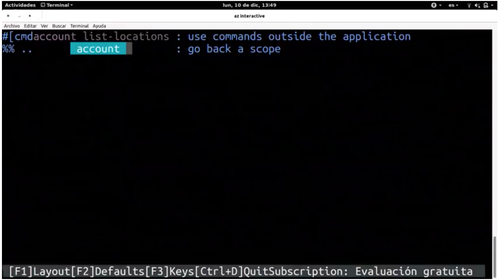

# La nube desde la línea de órdenes

**Repositorio: https://github.com/JJ/azure-cli**

**Presentación: https://jj.github.io/azure-cli/#/**

**Objetivo**: tener una serie de órdenes que nos permitan lanzar máquinas virtuales en la nube, en este caso, vamos hacer uso de Azure. Cualquier persona con la documentación de la nube, puede trabajar con ella. La documentación también es libre.

## ¿Qué hace falta para sacar provecho de la nube?

1. Tener instalado **Python2** (versión 2.6.7), aunque funciona con Python3. Da menos fallos y funciona mejor con Python2. Para ello, me creo un entorno con `pyenv`.
2. Saber que son las **APIs REST**.
3. Conocer las **líneas de órdenes de Linux**.
4. Conseguir la **cuenta de Azure**.

## Empezamos

1. Descargando CLI:az, es una herramienta escrita en Python que se descarga con `pip`, mejor con Python2, ya que _az interactiv_ da error con Python.

2. Nos conectamos a nuestra cuenta de Azure y metemos un código, y nos descarga unas credenciales:
~~~
az login
~~~

3. Listamos nuestras suscripciones (donde se va a cobrar esa cuenta)
~~~
az account list
~~~

  - El resultado lo devuelve con un JSON, el _id_, si la cuenta es por defecto, el _tenantId_...

  

  - Siempre tenemos una suscripción. Si decimos que nos liste, siempre es la misma estructura:
    - orden: _account_ por ejemplo.
    - suborden:
    - Devuelve el resultado en JSON.

    ~~~
    az orden suborden
    ~~~

4. Filtrar los resultados. Mme muestra todas las suscripciones que tengo:

  ~~~
  az account list -o table
  ~~~

  - `-o` como tienes que representar el resultado
  - Sirve para listar máquinas virtuales

  

### Ayuda interactiva: az interactive

Muestra los formatos, nos permite trabajar con ella, y la tenemos ahí; completa las órdenes. Te muestra el formato del resultado:

~~~
az interactive
~~~

### Filtrando

Es para tranajar con JSON y hacer querys.

- `vm` te dice las mv que tienes. Sin embargo, si se hace de esa forma, se filtra. Cada elemento tiene dos campos que se llaman offer y plublisher, lo que te lista es el nombre de la imagen.

### USando --query

Usa un lenguaje JSMPAX, distinto al de antes:

Te devuelve el resultado en una tabla separada por tabuladores.

Podemos presetar los resultados en forma de tabla, procesarlos en JSON, o usando JSMPATH y luego sacarlo como queramos.

### Elige tu suscripción

Puedes tener varias suscripciones, y hay qe decirlo cual es la suscripción que vamos a trabajar. Una vez que se dice, siempre se trabaja con esa.

Tambien se puee trabjar dede VS Code (alternativa a Atom), puede conectar tu cuenta a Azure con VS Code.

**Instalar VS Code.**

## Localizando los lugares

Cuando trabajar con Azure, tienes una serie de centros de datos, y debemos saber donde están. Para listar los centros de datos (Si estás en Europa los centros de datos que coges son los de Europa):

Estamos trabajando con  que lo estamos pasando por un filtro `jq`, el sitio donde están y el nombre al cuál me voy a referir a ello.

### Service principals

Te permite reglar el acceso al rescurso, para ello se crean los _service principals_.

- Esto te devuelve tres cosas: appID, password y tenant (inquilino)
- Te sirven para solicitar acceso a ciertos recursos, tenemos que crear ese service principals.

### Token

A continuación hay que pedir un token. Vamos a conseguir a mano este token. Tu aplicación va a tener ese token, mediante una petición a la API. Este token solo hace falta si quieres accerde a la APi de Azure en tus servicios que hayas creado.

- Le pasamos la appID y el password que hemos obtenido de antes.
- Y luego en post se lo pasamos a esa URL.

#### Ejemplo

Vamos hacer un programita que esta en Persels (`get-locations.p6`).

- Le pasas el nombre de la suscripción.
- .get le paso la URL - es muy importante especifar la versión de API. Las cosas importantes son las cabeceras del mensaje:
  - Te estoy pasando un token --> Bearee
  - application/JSON
- Podría ser más simple, pero no ha encontrado a forma de hacerlo con Python y Node, por eso lo hace en Perl.

**Ya sabemos todo esto**

### Los recursos se agrupan

Grupos de recursos: ¿Cómo crear un recurso?

Este concepto de grupo de recursos, donde lo vas a meter:

Las configuraciones por omisión, si no te decimos nada voy a trabajar con eso:

Sitios donde puedes poner cosas:

------
La voy a llamar cabazazcli1 (nada de minusculas)

Hay varios tipos de cuenta de almacenamiento.

Se puede usar para desplegar automáticamente cuentas/páginas estáticas. Algunas características de estas cuentas:

Puedede usar cool o hot:
- cool: que no vas acceder mucho a eso.
- hot
----

## Usemos los blobs

Almecaneamiento no estructurado. Dentro de cada cuenta se tienen containers: un ordenador con mucho discos duros.

### Contenedores para web

Vamos a crear un blob con las propiedades de servicios, y vamos crear un sitio web estático y el documento de índice. Si me meto en esta URL es una web que hay un index.html y sino lo encuentra salida 404

#### Crea una aplicacion estatica con react native, por ejemplo

1. Despliega

2. Te lo mete en um contentador que se llama $web.
3. Te despliega un sitio web.

----

A partir de aquí:

- Manejo de CLI desde Ansible: tiene un plugin que desde línea de ordenes lo puedas hacer desde ansible.
- Trabajar con contendedores Doccker, MVs
- Abstraccion con Terraform, es similar a vagrant (hipervisor), pero este si trabajar con todo los rercusos. Te abstrae del sistema que se va a usar.
