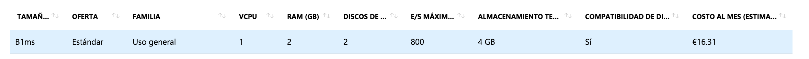
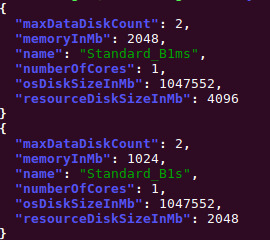

# Objetivos Hito 4

## Redireccionamiento del puerto 5000 al puerto 80

Aunque nuestra aplicación esté lanzada en el puerto 5000, nosotros haciendo uso de `gunicorn -b :80 main:app`, podemos decir que se redirija al puerto 80, sin usar sentencias o similares, simplemente al ejecutar la aplicación.

## Tamaños de imágenes de máquinas virtuales en Francia Central

